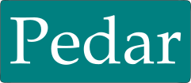

# The Pedar Programming Language
GNU General Public License v3.0
(version 1.0.0 alpha 1)



# How to contribute
To contribute in this repo, please open a pull request from your fork of this repository. We do have to ask you to sign the Pedar before we can merge any of your work, to protect its open source nature.

For more information on building and developing the core of Pedar.

```dart
import ('io', 'time');

main(){
    print("Hello World!\n");

    print("string is %s and number is %.5n \n", 'hello world!', 3.14, 'format %n\n', 2);

    file = io.file;
    keyboard = io.keyboard;

    f = file.open("help.chw", 'r');

    print("open file by fd %n\n", f.fd);

    buf = f.read(f.length());
    print("%s\n", buf);

    print("tell %n\n", f.tell());

    print("cwd %s\n", file.cwd());
    print("rename %n\n", file.rename("help","help.chw"));

    f.close();

    t = time.tick();
    sum = 0;
    i = 0;
    while(i < 1000000){
        sum = sum + i;
        i = i + 1;
    }

    fmt = format("%.2n in %.8n sec\n", sum, (time.tick() - t) / 1000000);
    print(fmt);
    print("size of fmt %.2n\n", sizeof(fmt));
    print("type of fmt %s\n", typeof(fmt));

    list = [0,10,20,30,40,50,60,70,80,90];
    insert(list, 1, 300);
    delete(list, 1, 2, 3, 4, 5, 6, 7);

    print("%s %n\n", list, count(list));

    print("what's your name?\n");
    input = keyboard.gets(100);
    print("%s", input);

    keyboard.get();
}
```

+ A Pedar program basically consists of the following parts
    - Import Packages
    - Class
    - Functions
    - Variables
    - Statements and Expressions
    - Comments

# Next Work
we use params for define a function.
```dart
pedar {
    @parameter1, @parameter2, @parameter3;
    /*  or set a variable on other class @parent_class_name.variable1
        or @variable1.variable2
    */
    fun_1 {
        return @parameter5 + parameter1 + parameter2 + parameter3;
    }
    @parameter4;
    return pedar;
}
```
equal to

```dart
class pedar<T> {
    private T parameter1, parameter2, parameter3, parameter4;
    pedar(T _a,T _b,T _c,T _d){
        parameter1 = _a;
        parameter2 = _b;
        parameter3 = _c;
        parameter4 = _d;
    }
    
    public T fun_1(T parameter5){
        return parameter5 + parameter1 + parameter2 + parameter3;
    }
}
```

# The Author
    Pedar was originally developed by Yasser Sajjadi (Ys) in 2019.
        Email: yassersajjadi@gmail.com

# License
GNU General Public License v3.0
